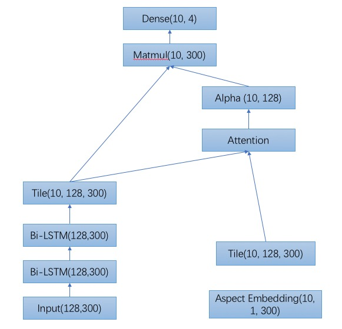

# CCF-BDCI2018 汽车领域ASC挑战赛

以前没接触过ASC、TSC领域，最开始纠结这是单分类还是多分类问题，走了一些弯路。最终我们回到ASC赛道上，根据直觉，我们设计了一个基于memory的lstm-attention模型，复赛B榜线上在0.69左右，融合最终得分0.70，单模型结构图如下：




后面时间比较紧张，复现今年ASC论文的代码效果都不好，最终排名6/1701，思路如同代码所写，很简单。

原始数据可在[比赛数据](https://www.datafountain.cn/competitions/310/details/data-evaluation)处下载，由于这次我们问题建模方式比较多，数据预处理代码也比较多，所以我会上传一份处理好的数据(包括处理好的Bert特征和百度百科词向量)放在[百度云盘](https://pan.baidu.com/s/1ZrgQ6Wp_sFRPrZGjZiBPaA)，下载后请解压放在`data/`目录下。

ELMo哈工大基于pytorch的pretrain版本和我用tf pretrain训练集的效果都不好，但是我也保留了tf pretrain版本代码。

Bert我们没有弄finetune，直接抽取的特征，效果和百度百科词向量相当。

若有任何想法可以提issue或者pull request，也可以微信与我直接讨论。希望大家一起学习进步。


### 一、环境

|环境/库|版本|
|:---------:|----------|
|Ubuntu|16.04.5 LTS|
|python|3.6|
|jupyter notebook|4.2.3|
|tensorflow-gpu|1.9.1|
|numpy|1.14.1|
|pandas|0.23.0|
|matplotlib|2.2.2|
|tqdm|4.24.0|

这里最重要的就是我们用的Cudnn版本的lstm，所以需要tensorflow版本大于1.4.0，相应的cuda版本不能用8.0，需要9.0及以上。


### 二、数据预处理

都写在`jupyter`里了，运行`src/preprocess/EDA.ipynb`生成各种文件，可用看看思路，但是建议直接下载云盘处理好的结果。


### 三、深度模型训练

数据预处理好即可用直接train模型，单GPU运行，模型请参考`src/config.py`自选，参数名含义请参考`src/train_predict.py`：

```
python train_predict.py --gpu 7 --model aspv0 --feature word --epoch 20 --bs 128 --oe
```


### 四、模型融合输出

```
python stacking.py --gpu 1 --data_type 3
```

这里是`stacking`和`pesudo label`一起做了，请修改代码自选是否用伪标签。

这里数据集比较合适，伪标签有一定提分作用。

### 五、提交结果

修改`src/pack_sub_dt2.py`里对应stacking生成的`pre_path`概率结果路径，运行

```
python python pack_sub_dt2.py
```

生成提交结果。


